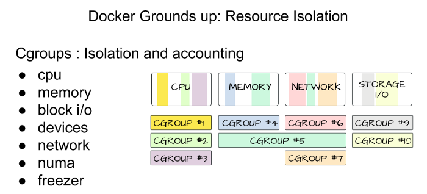
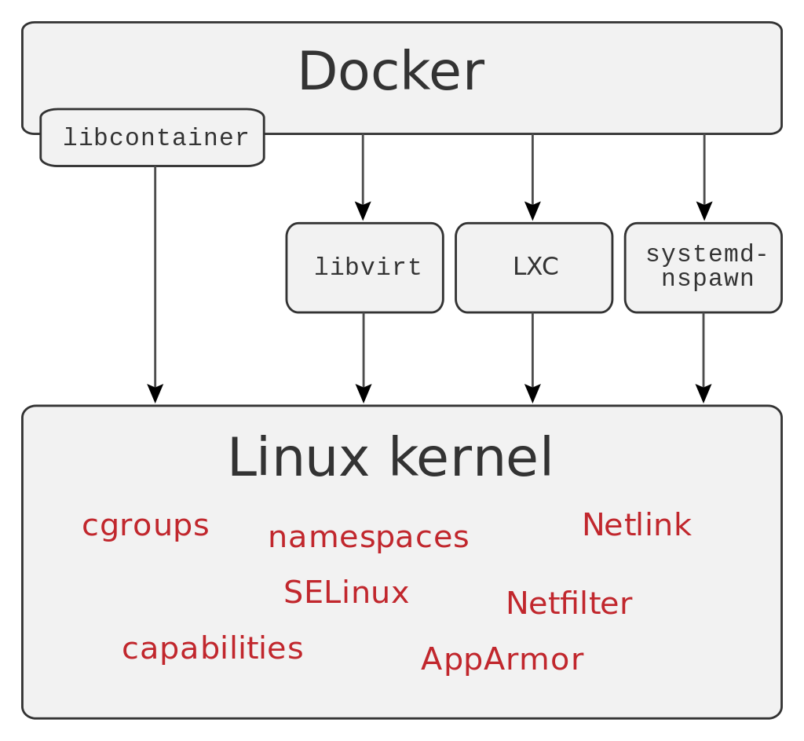

# Seguridad en Docker

La seguridad a la hora de desplegar contenedores tiene distintos aspectos que debemos siempre tener en cuenta:

### Seguridad dentro del contenedor

La seguridad dentro del contenedor no es muy distinta a lo que debemos aplicar para cualquier carga de trabajo que esté en producción

1. Evitar vulnerabilidades

Normalmente lo conseguimos mediante escáneres de vulnerabilidades, con la ventaja de que los contenedores normalmente tienen muchas menos dependencias y servicios ejecutándose que una máquina normal. Además al ser una forma estándar de desplegar cualquier carga de trabajo, existen herramientas para analizarlas de forma sencilla.

Casi todos los registries privados incluyen un servicio de escaneado, y también puedes desplegar el tuyo propio. Por ejemplo Anchore es un buen proyecto de código abierto: [https://anchore.com/](https://anchore.com/)


2. Desplegar con un usuario con permisos limitados

Por defecto los contenedores levantan sus procesos con usuario root. Esto no es un problema de seguridad ya que ese usuario root sólo tiene permisos dentro del contenedor en el que corre el proceso. Pero es cierto que este contenedor puede que tenga acceso a volúmenes, puertos de otros contenedores, etc que hace que en caso de resultas el contenedor comprometido, ese usuario root tenga más permisos de los necesarios.

Por ello es una buena práctica especificar un usuario distinto. Esto podemos hacerlo en es Dockerfile con el comando `USER`:

```
RUN groupadd --gid 1000 python && useradd -ms /bin/bash -g python -u 1000 python
USER python
```

Primero hemos creado el usuario llamado python con uid 1000, y con el comando `USER` hemos dicho al Dockerfile que a partir de ese comando todos se ejecutarán con el usuario Python. Es importante poner este comando después de haber instalado y ejecutado todos los pasos del Dockerfile que requieran permisos de root.

También es posible modificar el usuario con el que se ejecuta un contenedor con la opción `--user` de `docker run`:

``` docker run --user 1000:1000 flask-app```


### Seguridad en el host

Aparte de todos los aspectos de seguridad a tener en cuenta en cualquier máquina, tenemos que tener uno más en cuenta para Docker: la protección del propio motor de Docker. El motor de Docker se ejecuta con permisos de root y puede levantar contenedores con toda clase de permisos. Por ello debemos limitar los usuarios con permisos para levantar contenedores y proteger el puerto del motor de docker (2376) en caso de que lo utilicemos.

### Fijar la versión de las imágenes

Es importante asegurarnos de que siempre desplegamos la imagen que queremos. Por supuesto debemos evitar el tag latest y utilizar siempre tags de versiones específicas. Pero incluso esos tags pueden sobreescribirse. Por ello una medida de seguridad recomendada es utilizar el hash de la imagen para asegurarnos de que siempre desplegamos la imagen que queremos.

Esto lo podemos hacer simplemente añadiendo `@sha256:<HASH>` justo después del tag de la imagen. Por ejemplo:

```docker pull nginx:1.18@sha256:f35b49b1d18e083235015fd4bbeeabf6a49d9dc1d3a1f84b7df3794798b70c13```

El hash de la imagen lo podemos encontrar al hacer docker pull o en DockerHub

### Límite de recursos

Poner un coto a los recursos que puede utilizar un contenedor nos ayudará a evitar que un sólo contenedor pueda acaparar todos los recursos de su host y tirar así todos los demás contenedores. Por ejemplo, por errores de programación o por ataques DDoS.



#### Memoria

La limitaremos con el parámetro `-m` de `docker run`. Por ejemplo:

```
docker run -m 0.1G nginx
```

Podemos utilzar cualquier unidad de memoria.

El comportamiento del contenedor si el proceso que ejecuta pide más memoria del límite es matar directamente el proceso y por tanto el contenedor, entendiendo que éste no se puede ejecutar con menos memoria de la que pide.

#### CPU

Con el parámetro `--cpus`

```
docker run -m 0.1G --cpus 0.2 nginx
```

El valor se refiere a la cantidad de cores que estarán disponibles para la aplicación. En caso de ser decimal, Docker permitirá una fración del tiempo de core para ese contenedor.

Los contenedores, al contrario que en el límite de memoria, no se terminan cuando llegan al límite de CPU. Docker simplemente limita el tiempo de CPU que pueden utilizar. Si llegan al límite, deberán esperar al siguiente ciclo. Nuestra aplicación simplemente irá más lenta, pero continuará funcionando.

Hay muchos más parámetros que puedes usar para configurar el comportamiento de la memoria, CPU y GPUs en los contenedores. Puedes encontrar la referencia aquí: [https://docs.docker.com/config/containers/resource_constraints/](https://docs.docker.com/config/containers/resource_constraints/)

### Healthchecks

Es importante siempre configurar un buen Healthcheck para que Docker pueda saber si nuestra aplicación se está ejecutando correctamente o no. Que un proceso esté levantado no signofic que la aplicación esté en perfecto estado.

Un healthcheck en Docker será simplemente un comando que se ejcutará de forma periódica. En caso de terminar con éxito, Docker entiende que la aplicación está sana. En caso contrario, que no es así y que tras un número de fallos ajustable, deberá reiniciar el contenedor.

Podemos configurar Healthchecks en el Dockerfile con

```
HEALTHCHECK --interval=30s --timeout=1s --start-period=60s --retries=3 CMD [ "curl", "-q", "localhost:5000/" ]
```

O a en `docker run` con `--health-cmd ` y `--health-interval`. Hay otros parámetros que también puedes usar para configurarlo: [https://docs.docker.com/engine/reference/run/#healthcheck](https://docs.docker.com/engine/reference/run/#healthcheck)

También puedes definir la política de reinicio para el contenedor con `--restart`

### Monitoring

Al ejecutarse todas las cargas dentro de contenedores, es fácil monitorizar su consumo de recursos con herramientas estándar. Éstas son solo algunas de ellas:

* El comando `docker stats`

* cAdvisor: es simplemente un dashboard para los datos de docker stats: [https://github.com/google/cadvisor](https://github.com/google/cadvisor). Se puede desplegar dentro de un contenedor en cualquier host.

* Prometheus: Es un servidor de métricas open source muy utilizado porque se integra fácilmente con Docker y Kubernetes (y muchos otros servicios). Obtiene métricas de uso del motor de Docker y las almacena en su servidor. A partir de ahí podemos consultarlas, crear Dashboards con Grafana y configurar alertas: [https://prometheus.io/](https://prometheus.io/)

### Otros aspectos de seguridad avanzados



Limitar las capabilities y syscalls que puede realizar el contendor. Éstos parámetros permiten limitar los recursos del kernel del host a los que un contenedor tiene acceso. Por defecto estos están muy limitados, siempre se pueden modificar los permisos por defecto apra asignar algunoq ue sea necesario o quitar los que no.

[https://docs.docker.com/engine/security/#linux-kernel-capabilities](https://docs.docker.com/engine/security/#linux-kernel-capabilities)

[https://docs.docker.com/engine/security/apparmor/](https://docs.docker.com/engine/security/apparmor/)

[https://docs.docker.com/engine/security/seccomp/](https://docs.docker.com/engine/security/seccomp/)


Firma de imágenes: Se pueden configurar los host para que solo desplieguen imágenes que han sido firmadas por algún sistema en el que confiemos (por ejemplo, nuestro servidor de CI después de pasar los tests pertienentes). De esta forma evitamos por compelto que nadie pueda desplegar imágenes en las que no confiamos o que no han pasado los requisitos que queramos.

[https://docs.docker.com/engine/security/trust/](https://docs.docker.com/engine/security/trust/)


Utilizar user namespaces: es posible configurar el motor de Docker para que evite mapear los usuarios dentro del contenedor con usuarios del host. Lo que hace en su lugar es mapear los usuarios del contenedor con uids aleatorios en el host, que no tendrán ningún permiso.

[https://docs.docker.com/engine/security/userns-remap/](https://docs.docker.com/engine/security/userns-remap/)
